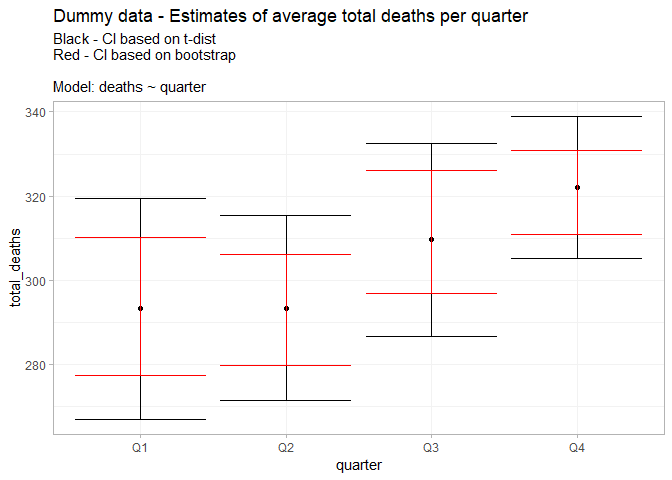
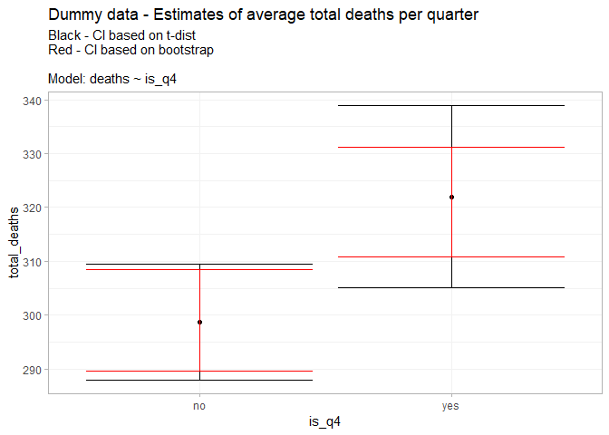

--- 
title: "CI for multi-site chronic disease dashboard"
author: "Nayef Ahmad"
date: "2019-11-07"
output: 
  html_document: 
    keep_md: yes
    code_folding: hide
    toc: true
    toc_float: 
      collapsed: false 
    toc_folding: false
---


# Data 

Play with test data 


```r
df1.test_discharges <- 
  tibble::tribble(
      ~fyear, ~quarter, ~is_q4, ~site, ~total_discharges, ~alos_days, ~total_deaths,
    "fy2015",     "Q1",   "no", "VGH",              7193,        9.5,           282,
    "fy2015",     "Q2",   "no", "VGH",              7064,        9.7,           301,
    "fy2015",     "Q3",   "no", "VGH",              7365,        9.8,           300,
    "fy2015",     "Q4",  "yes", "VGH",              7190,        9.8,           300,
    "fy2016",     "Q1",   "no", "VGH",              7246,        9.6,           319,
    "fy2016",     "Q2",   "no", "VGH",              6897,       10.2,           268,
    "fy2016",     "Q3",   "no", "VGH",              7241,         10,           292,
    "fy2016",     "Q4",  "yes", "VGH",              7011,       10.2,           319,
    "fy2017",     "Q1",   "no", "VGH",              6898,       10.2,           283,
    "fy2017",     "Q2",   "no", "VGH",              6756,       10.2,           283,
    "fy2017",     "Q3",   "no", "VGH",              6739,       10.1,           300,
    "fy2017",     "Q4",  "yes", "VGH",              6931,       10.3,           330,
    "fy2018",     "Q1",   "no", "VGH",              6900,       10.1,           270,
    "fy2018",     "Q2",   "no", "VGH",              6784,         10,           303,
    "fy2018",     "Q3",   "no", "VGH",              6943,        9.9,           318,
    "fy2018",     "Q4",  "yes", "VGH",              7160,        9.8,           326,
    "fy2019",     "Q1",   "no", "VGH",              7094,        9.8,           312,
    "fy2019",     "Q2",   "no", "VGH",              6980,        9.8,           312,
    "fy2019",     "Q3",   "no", "VGH",              7132,        9.9,           338,
    "fy2019",     "Q4",  "yes", "VGH",              7149,       10.1,           335
    ) %>% 
  mutate_if(is.character, as.factor)

# str(df1.test_discharges)
# summary(df1.test_discharges)

# df1.test_discharges %>% 
#   datatable(extensions = 'Buttons',
#           options = list(dom = 'Bfrtip', 
#                          buttons = c('excel', "csv")))
#                          

# df1.test_discharges %>% 
#   ggplot(aes(x = total_deaths)) +
#   geom_density()
#   
# df1.test_discharges %>% 
#   ggplot(aes(x = alos_days)) +
#   geom_density()
# 
# df1.test_discharges %>% 
#   ggplot(aes(x = total_discharges)) +
#   geom_density()
```

# Models - total deaths 
## Total deaths vs quarter 
 


```r
m1.deaths <- lm(total_deaths ~ quarter, 
                data = df1.test_discharges)

summary(m1.deaths)
```

```
## 
## Call:
## lm(formula = total_deaths ~ quarter, data = df1.test_discharges)
## 
## Residuals:
##    Min     1Q Median     3Q    Max 
## -25.40 -10.60   0.50  10.45  28.40 
## 
## Coefficients:
##             Estimate Std. Error t value Pr(>|t|)    
## (Intercept)  293.200      8.023  36.546   <2e-16 ***
## quarterQ2      0.200     11.346   0.018   0.9862    
## quarterQ3     16.400     11.346   1.445   0.1676    
## quarterQ4     28.800     11.346   2.538   0.0219 *  
## ---
## Signif. codes:  0 '***' 0.001 '**' 0.01 '*' 0.05 '.' 0.1 ' ' 1
## 
## Residual standard error: 17.94 on 16 degrees of freedom
## Multiple R-squared:  0.3615,	Adjusted R-squared:  0.2418 
## F-statistic:  3.02 on 3 and 16 DF,  p-value: 0.06047
```

**Note that the F-stat is not significant. This model may not be useful.**
 


```r
m1.deaths %>% 
  tidy() %>% 
  datatable(extensions = 'Buttons',
            options = list(dom = 'Bfrtip', 
                           buttons = c('excel', "csv")))
```

<!--html_preserve--><div id="htmlwidget-737400c9e08f3ae8bd8b" style="width:100%;height:auto;" class="datatables html-widget"></div>
<script type="application/json" data-for="htmlwidget-737400c9e08f3ae8bd8b">{"x":{"filter":"none","extensions":["Buttons"],"data":[["1","2","3","4"],["(Intercept)","quarterQ2","quarterQ3","quarterQ4"],[293.2,0.200000000000003,16.4,28.8],[8.02278006678483,11.3459243783836,11.3459243783836,11.3459243783836],[36.5459351445865,0.0176274751470268,1.44545296205618,2.53835642117182],[7.61301096808128e-017,0.986153984215409,0.167632707092766,0.0219127988596197]],"container":"<table class=\"display\">\n  <thead>\n    <tr>\n      <th> <\/th>\n      <th>term<\/th>\n      <th>estimate<\/th>\n      <th>std.error<\/th>\n      <th>statistic<\/th>\n      <th>p.value<\/th>\n    <\/tr>\n  <\/thead>\n<\/table>","options":{"dom":"Bfrtip","buttons":["excel","csv"],"columnDefs":[{"className":"dt-right","targets":[2,3,4,5]},{"orderable":false,"targets":0}],"order":[],"autoWidth":false,"orderClasses":false}},"evals":[],"jsHooks":[]}</script><!--/html_preserve-->

### Confidence intervals 


```r
df2.nested <-                            
  df1.test_discharges %>% 
  group_by(quarter) %>% 
  nest() %>% 
  mutate(conf = map(data, 
                       function(df){
                         mean <- smean.cl.normal(df$total_deaths)[1]
                         lwr <- smean.cl.normal(df$total_deaths)[2]
                         upr <- smean.cl.normal(df$total_deaths)[3]
                         
                         return(data.frame(lwr_death = lwr, 
                                           mean_death = mean, 
                                           upr_death = upr))
                       })) # %>% View("confint")

df2.nested %>% 
  unnest(conf) %>% 
  select(quarter, 
         lwr_death:upr_death) %>% 
  datatable(extensions = 'Buttons',
            options = list(dom = 'Bfrtip', 
                           buttons = c('excel', "csv")))
```

<!--html_preserve--><div id="htmlwidget-dc6107cb5c878d08102a" style="width:100%;height:auto;" class="datatables html-widget"></div>
<script type="application/json" data-for="htmlwidget-dc6107cb5c878d08102a">{"x":{"filter":"none","extensions":["Buttons"],"data":[["1","2","3","4"],["Q1","Q2","Q3","Q4"],[266.957085514424,271.457299209323,286.610766274962,305.088736908121],[293.2,293.4,309.6,322],[319.442914485576,315.342700790677,332.589233725038,338.911263091879]],"container":"<table class=\"display\">\n  <thead>\n    <tr>\n      <th> <\/th>\n      <th>quarter<\/th>\n      <th>lwr_death<\/th>\n      <th>mean_death<\/th>\n      <th>upr_death<\/th>\n    <\/tr>\n  <\/thead>\n<\/table>","options":{"dom":"Bfrtip","buttons":["excel","csv"],"columnDefs":[{"className":"dt-right","targets":[2,3,4]},{"orderable":false,"targets":0}],"order":[],"autoWidth":false,"orderClasses":false}},"evals":[],"jsHooks":[]}</script><!--/html_preserve-->

```r
df1.test_discharges %>% 
  ggplot(aes(x = quarter, 
             y = total_deaths)) + 
  stat_summary(fun.y = mean, 
               geom = "point") + 
  stat_summary(fun.data = mean_cl_normal, 
               geom = "errorbar") + 
  stat_summary(fun.data = mean_cl_boot, 
               geom = "errorbar", 
               col = "red") + 
  
  labs(title = "Dummy data - Estimates of average total deaths per quarter", 
       subtitle = "Black - CI based on t-dist \nRed - CI based on bootstrap \n\nModel: deaths ~ quarter") + 
  theme_light() +
  theme(panel.grid.minor = element_line(colour = "grey95"), 
        panel.grid.major = element_line(colour = "grey95"))
```

<!-- -->

## Total deaths vs is_q4


```r
m2.deaths <- lm(total_deaths ~ is_q4, 
                data = df1.test_discharges)

summary(m2.deaths)
```

```
## 
## Call:
## lm(formula = total_deaths ~ is_q4, data = df1.test_discharges)
## 
## Residuals:
##     Min      1Q  Median      3Q     Max 
## -30.733 -15.733   1.767  13.067  39.267 
## 
## Coefficients:
##             Estimate Std. Error t value Pr(>|t|)    
## (Intercept)  298.733      4.728  63.187   <2e-16 ***
## is_q4yes      23.267      9.455   2.461   0.0242 *  
## ---
## Signif. codes:  0 '***' 0.001 '**' 0.01 '*' 0.05 '.' 0.1 ' ' 1
## 
## Residual standard error: 18.31 on 18 degrees of freedom
## Multiple R-squared:  0.2517,	Adjusted R-squared:  0.2101 
## F-statistic: 6.055 on 1 and 18 DF,  p-value: 0.0242
```

```r
m2.deaths %>% 
  tidy() %>% 
  datatable(extensions = 'Buttons',
            options = list(dom = 'Bfrtip', 
                           buttons = c('excel', "csv")))
```

<!--html_preserve--><div id="htmlwidget-14a2fd904ed8877c83ed" style="width:100%;height:auto;" class="datatables html-widget"></div>
<script type="application/json" data-for="htmlwidget-14a2fd904ed8877c83ed">{"x":{"filter":"none","extensions":["Buttons"],"data":[["1","2"],["(Intercept)","is_q4yes"],[298.733333333333,23.2666666666667],[4.72774840048322,9.45549680096643],[63.1872316434606,2.46064983748803],[1.37308295850392e-022,0.0242046651116037]],"container":"<table class=\"display\">\n  <thead>\n    <tr>\n      <th> <\/th>\n      <th>term<\/th>\n      <th>estimate<\/th>\n      <th>std.error<\/th>\n      <th>statistic<\/th>\n      <th>p.value<\/th>\n    <\/tr>\n  <\/thead>\n<\/table>","options":{"dom":"Bfrtip","buttons":["excel","csv"],"columnDefs":[{"className":"dt-right","targets":[2,3,4,5]},{"orderable":false,"targets":0}],"order":[],"autoWidth":false,"orderClasses":false}},"evals":[],"jsHooks":[]}</script><!--/html_preserve-->

### Confidence intervals 


```r
df2.nested <-                            
  df1.test_discharges %>% 
  group_by(is_q4) %>% 
  nest() %>% 
  mutate(conf = map(data, 
                    function(df){
                      mean <- smean.cl.normal(df$total_deaths)[1]
                      lwr <- smean.cl.normal(df$total_deaths)[2]
                      upr <- smean.cl.normal(df$total_deaths)[3]
                      
                      return(data.frame(lwr_death = lwr, 
                                        mean_death = mean, 
                                        upr_death = upr))
                    })) # %>% View("confint")

df2.nested %>% 
  unnest(conf) %>% 
  select(is_q4, 
         lwr_death:upr_death) %>% 
  datatable(extensions = 'Buttons',
            options = list(dom = 'Bfrtip', 
                           buttons = c('excel', "csv")))
```

<!--html_preserve--><div id="htmlwidget-eddeab13439723bcb6ec" style="width:100%;height:auto;" class="datatables html-widget"></div>
<script type="application/json" data-for="htmlwidget-eddeab13439723bcb6ec">{"x":{"filter":"none","extensions":["Buttons"],"data":[["1","2"],["no","yes"],[287.965640203553,305.088736908121],[298.733333333333,322],[309.501026463114,338.911263091879]],"container":"<table class=\"display\">\n  <thead>\n    <tr>\n      <th> <\/th>\n      <th>is_q4<\/th>\n      <th>lwr_death<\/th>\n      <th>mean_death<\/th>\n      <th>upr_death<\/th>\n    <\/tr>\n  <\/thead>\n<\/table>","options":{"dom":"Bfrtip","buttons":["excel","csv"],"columnDefs":[{"className":"dt-right","targets":[2,3,4]},{"orderable":false,"targets":0}],"order":[],"autoWidth":false,"orderClasses":false}},"evals":[],"jsHooks":[]}</script><!--/html_preserve-->

```r
df1.test_discharges %>% 
  ggplot(aes(x = is_q4, 
             y = total_deaths)) + 
  stat_summary(fun.y = mean, 
               geom = "point") + 
  stat_summary(fun.data = mean_cl_normal, 
               geom = "errorbar") + 
  stat_summary(fun.data = mean_cl_boot, 
               geom = "errorbar", 
               col = "red") + 
  
  labs(title = "Dummy data - Estimates of average total deaths per quarter", 
       subtitle = "Black - CI based on t-dist \nRed - CI based on bootstrap \n\nModel: deaths ~ is_q4") + 
  theme_light() +
  theme(panel.grid.minor = element_line(colour = "grey95"), 
        panel.grid.major = element_line(colour = "grey95"))
```

<!-- -->


---
title: "2019-11-07_vch_confidence-intervals-for-multi-site-dashboard-chronic-disease-population.R"
author: "nahmad3"
date: "2019-11-08"
---
